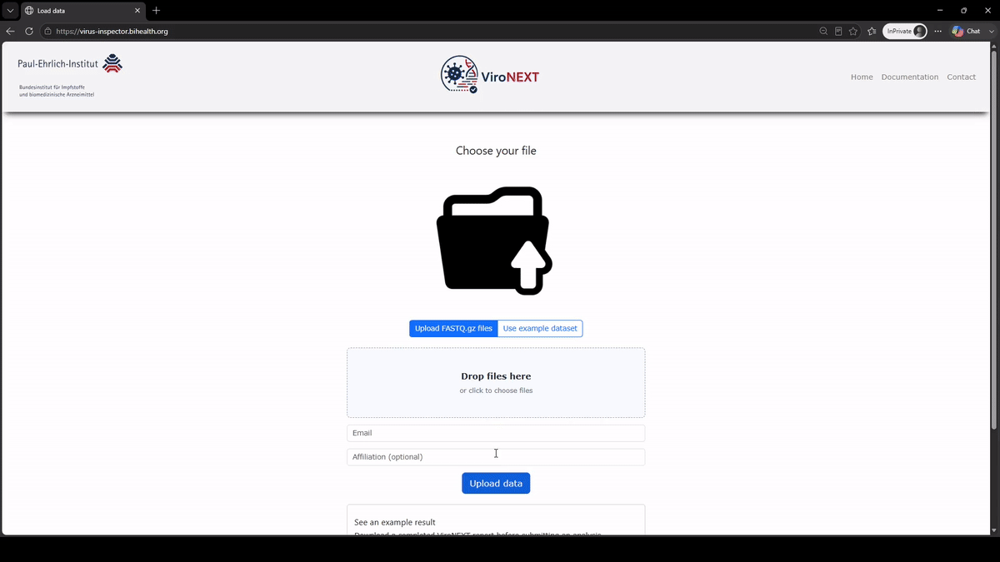

<p align="center">

<!-- ===================== -->
<!--      LOGO             -->
<!-- ===================== -->


<!-- Placeholder for ViroNEXT logo -->

</p>

<p align="center">

<b>Reliable viral detection from metagenomic sequencing data with stringent false-positive control.</b>

</p>

<p align="center">

<!-- Activate badges before the public release -->

[](https://stats.uptimerobot.com/FU5jYspyB7)
<!-- 
[]()
-->
[](https://github.com/brama108/vironext/releases/latest)


<!-- Add license
[]()
-->

<!-- Add DOI badge after publication -->

</p>

---

## Overview

ViroNEXT is a freely available end-to-end platform for viral detection from metagenomic short-read sequencing data.

The workflow combines reference-based classification, machine-learning–assisted viral sequence classification and multiple orthogonal validation strategies to enable reliable viral detection while minimizing false-positive classifications.

Designed for researchers and public health laboratories, ViroNEXT supports applications including:

- Pathogen discovery
- Metagenomic profiling
- Surveillance of emerging viral threats

ViroNEXT can be accessed through a publicly available web portal or executed locally as a Snakemake workflow.

---

# 🌐 Analyze Your Data Online

No installation required.

No command line required.

No bioinformatics expertise required.

### Web Portal

https://vironext.bihealth.org/

The web portal provides

- Upload of paired-end or single-end FASTQ files
- Fully automated analysis
- Interactive HTML reports
- Viral genome assemblies
- Alignment files
- Downloadable result package

---

# Workflow

ViroNEXT integrates complementary analytical strategies to maximize viral detection while maintaining stringent control of false-positive classifications.

<p align="center">

 

</p>

---

# Key Features

- End-to-end viral metagenomics workflow
- Hybrid reference-based and machine-learning viral sequence classification
- Detection of highly divergent viral sequences
- Multiple orthogonal validation strategies
- Stringent false-positive control
- Automated interactive HTML reports
- Public web interface
- Snakemake workflow
- Freely available for research use

---

# Quick Start

## Option 1 — Web Portal (Recommended)

Upload your sequencing data directly through the ViroNEXT web interface.

👉 https://vironext.bihealth.org/

---

## Option 2 — Local Installation

Clone the repository

```bash
git clone https://github.com/brama108/ViroNEXT.git
cd ViroNEXT
```

Run the installation script

```bash
bash setup.sh
```

> **Note**
>
> The installation script is currently under active development.
> Depending on the operating system, some Conda environments may require manual installation.

---

# Input

Supported input formats

- Paired-end FASTQ
- Single-end FASTQ

---

# Output

ViroNEXT automatically generates

- Interactive HTML report
- Viral genome assemblies (FASTA)
- Alignment files (BAM)
- Taxonomic classification tables
- Summary statistics

Intermediate files are retained to ensure reproducibility.

---

# Example Analysis

A complete example analysis is included in the repository.

```
docs/
└── examples/
    ├── sample_R1.fastq.gz
    ├── sample_R2.fastq.gz
    ├── sample_report.html
    └── README.md
```

The example dataset (~5,000–10,000 reads) allows users to verify their installation and explore the generated report without using their own sequencing data.

---

# Documentation

Additional documentation can be found in the `docs/` directory.

- Installation Guide
- User Guide
- Example Analysis
- Frequently Asked Questions

---

# Citation

**Publication pending**

If you use ViroNEXT in your research, please cite the accompanying publication once available.

Until then, please cite this GitHub repository.

---

# License

**License information will be added later.**

---

# Disclaimer

ViroNEXT is intended for **research use only**.

It has **not** been developed or validated for clinical diagnostic use and should not be used as the sole basis for clinical decision making.

---

# Contact

For bug reports, feature requests and general questions, please use the **GitHub Issues** page.

For other questions please contact:

**Markus Braun**  
Paul-Ehrlich-Institut  
Bundesinstitut für Impfstoffe und biomedizinische Arzneimittel 
Paul-Ehrlich-Straße 51-59  
63225 Langen  
Germany

📧 markus [dot] braun [at] pei [dot] de

